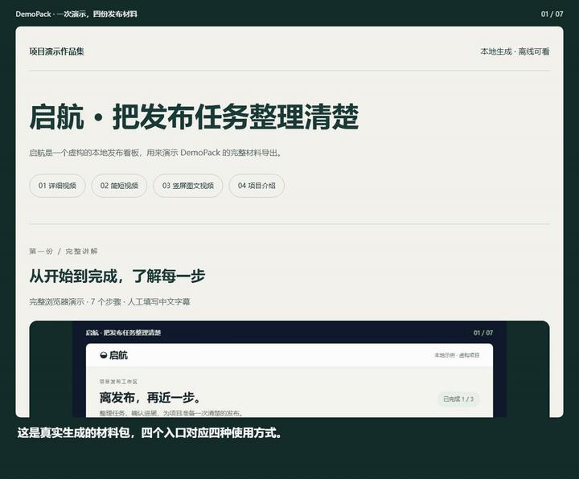

# DemoPack

**一次真实浏览器运行，整理出一整套 GitHub 演示材料。**

**配合 Codex，基本不用自己动手写脚本、录屏和整理材料。**
把项目位置、要展示的功能和风格告诉 Codex，让它协助检查环境、编写步骤与中文文案、
运行 DemoPack 并检查结果。你主要负责描述需求、处理必要的登录或权限，以及验收成品。
这不是“任何项目都能零操作成功”的保证；不同页面可能需要调整定位和演示步骤。

**[复制这段提示词，让 Codex 帮你生成 →](docs/USE-WITH-CODEX.zh-CN.md)**
DemoPack 本身不调用模型、不需要 API Key；使用 Codex 需要另外具备其访问权限，并遵循其服务条件。

输入明确的网页步骤，一次生成四份材料：**详细视频、简短视频、竖屏图文视频、项目介绍**。
同时保留短 GIF、关键截图、README 图文片段与离线预览。
本地处理，人工填写说明，无账号、无模型 API Key、无默认水印。

[English](README.md) · [观看真实演示](docs/kit-self-showcase/demo.mp4) · [中文示例材料包](docs/showcase-zh/index.html)



上面的演示由 DemoPack 录制自己实际生成的预览页，展示详细视频、短视频、竖屏图文和项目介绍四个入口。
[录制步骤](docs/kit-self-demo.json) · [本地任务看板演示](docs/showcase/demo.mp4)

## 启动

本地已构建时，Windows 可双击根目录的 `start-preview.cmd`：它会选择空闲端口并打开预览。
终端窗口必须保持运行；关闭窗口会停止服务。也可使用 `node dist/cli.js preview docs --port 0 --open`。

当前是**早期源码版本**，尚未发布 npm 包。下载源码后进入项目目录，使用 Node.js 24 LTS，并准备带 libx264
编码器的 FFmpeg 和 ffprobe。不要把下面的项目名当作已发布包执行 `npx`。

```sh
npm ci
npx playwright install chromium
npm run build
node dist/cli.js doctor
node dist/cli.js init my-demo
node dist/cli.js generate my-demo/demo.json
```

输出保存到独立的 `output/<时间戳>-<标识>`。直接打开该目录的 `index.html` 即可离线查看，也可以：

```sh
node dist/cli.js preview output/<实际输出目录名>
```

预览仅监听本机 127.0.0.1:4173，可用 `--port 4174` 改端口。`init` 不覆盖已有目录。
生成时按 Ctrl+C 会取消；失败与取消目录只有 `failure.json`，不会保留被标为成功的成品。

媒体工具安装：macOS 用 `brew install ffmpeg`，Ubuntu 用 `sudo apt install ffmpeg`。
Windows 从 [FFmpeg 官方下载入口](https://ffmpeg.org/download.html) 选择构建，将 `bin` 加入 PATH。
Linux 可用 `npx playwright install --with-deps chromium` 安装浏览器依赖；中文字幕需要 Noto Sans CJK
等中文字体。安装需要下载依赖，运行不依赖云服务。

可在当前 PowerShell 设置绝对路径，不必修改全局配置：

```powershell
$env:DEMOPACK_FFMPEG = 'C:\tools\ffmpeg\bin\ffmpeg.exe'
$env:DEMOPACK_FFPROBE = 'C:\tools\ffmpeg\bin\ffprobe.exe'
node dist/cli.js doctor
```

本地评审工作区已经准备 `.tools/ffmpeg.exe` 和 `.tools/ffprobe.exe`，从项目根目录运行会自动发现。
这些文件已忽略，不随源码或 npm 包分发。

## 编写步骤

修改初始化目录的 `demo.json`，填写目标网页、选择器、虚构数据与说明。本地 HTML 必须位于配置文件所在
目录之下；HTTP(S) 应用请提前启动。

```json
{
  "title": "我的项目：三步上手",
  "url": "http://localhost:3000",
  "steps": [
    { "action": "fill", "selector": "#name", "value": "示例用户", "caption": "填写虚构的演示数据。" },
    { "action": "click", "selector": "#save", "caption": "保存这条记录。", "holdMs": 3000 },
    { "action": "wait", "text": "已保存", "caption": "确认保存成功。", "screenshot": true }
  ]
}
```

支持打开页面、点击、填写、按键、等待元素/文字/时间、关键截图。按键示例：
`{ "action": "press", "selector": ".new-todo", "key": "Enter", "caption": "提交任务。" }`。
支持 Enter、Tab、Escape、Backspace、Delete、四个方向键与 Space。
步骤说明、停留时间、背景色、边距、GIF 片段和
1–1.5 倍局部裁切缩放均可配置。[完整配置](docs/CONFIGURATION.md) · [JSON Schema](demo.schema.json)。
Codex 可帮忙编写配置，DemoPack 运行本身不调用模型。

## 产物如何使用

`init` 创建的中文示例已配置四份材料，直接 `generate` 即可。修改 `demo.json` 中的
`release.short` 选择短片步骤，`release.social` 设置竖屏卡片，`release.project` 填写介绍。
所有文案由作者填写，工具不自动推断功能或编造介绍。旧配置省略 `release` 时维持原有导出。
[完整四份材料配置](docs/RELEASE-KIT.md) · [新标准真实示例](docs/kit-showcase/index.html)

录制前可用 `node dist/cli.js validate my-demo/demo.json` 检查配置，错误会指出具体字段；这不检查网页选择器。
导出后运行 `node dist/cli.js verify "实际产物目录"`，检查必需文件与哈希；这不替代画面验收。
要把图文片段粘贴到根 README，可运行 `node dist/cli.js snippet "实际产物目录" --prefix docs/demo`，
复制打印出的 Markdown。它会自动给图片和下载链接添加仓库相对路径，产物中的原始片段不变。

| 文件 | 用途 |
| --- | --- |
| `demo.mp4` | 完整 H.264 演示视频 |
| `short.mp4` | 配置步骤的重点短片，保留原速与原字幕 |
| `social.mp4`、`cards/*.png` | 1080 × 1920 竖屏图文视频与独立图片 |
| `social-caption.md` | 作者提供或由卡片文字整理的发布文案 |
| `project.md`、`project.html` | 可编辑的项目介绍与离线阅读页 |
| `walkthrough.html` | 四份材料包中的完整步骤与截图 |
| `demo.gif` | 可配置长度和尺寸的 README 短片段 |
| `cover.jpg`、`screenshots/*.jpg` | 与视频同源的封面和关键画面 |
| `README-snippet.md` | 人工步骤说明与相对图片路径 |
| `index.html` | 所有资源位于本地的离线预览 |
| `manifest.json` | 成功标记、步骤时间、媒体测量和文件哈希 |

把**整个产物目录**复制到仓库的 `docs/demo/` 等位置。图文片段在该目录内可直接使用；粘贴到仓库根 README
时，给相对链接加上 `docs/demo/` 前缀。不要只复制 HTML 或只复制 Markdown。

## 示例与验证

```sh
node dist/cli.js generate examples/launch/demo.json
node dist/cli.js generate "examples/中文便签/demo.json"
npm run typecheck
npm test
npm run test:integration
npm run test:kit
```

两个示例都不需要登录，数据均为虚构。[验证记录](docs/FINAL-ACCEPTANCE.md) 区分构建、自动测试、实际画面检查及
未覆盖平台。每次运行目录独立，旧产物不覆盖。

四份材料的新默认示例位于 `examples/starter/demo.json`，中文便签也已升级。
[本轮验收](docs/RELEASE-KIT-ACCEPTANCE.md) 单独记录本次导出、取消与离线检查。

## 已知限制

- 默认目标采样 10 fps，清单记录实测帧率和最大采样间隔；25 fps MP4 使用重复帧，不等于采集了 25 fps。
  适合普通网页教程，不适合强调高速动画的展示。
- 缩放是逐步骤固定裁切，不是平滑镜头；没有音频、桌面录制、摄像头、多轨剪辑、云存储、团队或收费功能。
  首版仅支持单页操作，不支持弹窗、多标签和 iframe 流程。
- 不导入已有浏览器身份、认证状态或原始网络日志。目标网页本身仍可能访问网络；使用可信页面和虚构数据，
  任何可见信息都会进入画面。
- 字幕最多两行，过长会报错；中文需要系统中文字体。系统与浏览器差异可能影响文字布局。
- 录制临时帧会占用磁盘；强制杀进程或断电可能留下 `_work`，没有成功清单的目录不算成品。
- 已实测 Windows；Linux CI 配置已提供但未在远端执行，macOS 尚未验证。

## 定位与开源

已有工具实现了大量录制、美化和重放能力。DemoPack 的假设是：一次整理完整、同源、可移动的发布材料包，
能减少维护者实际发布时的重复劳动。这仍需真实用户验证，不承诺 Star 数。
[四个竞品的当前核对与复用选择](docs/COMPETITORS.md)。

项目代码使用 MIT。[第三方声明](THIRD_PARTY_NOTICES.md) · [贡献说明](CONTRIBUTING.md)。
FFmpeg、浏览器和字体有各自许可，不随项目代码许可证一并授权。
