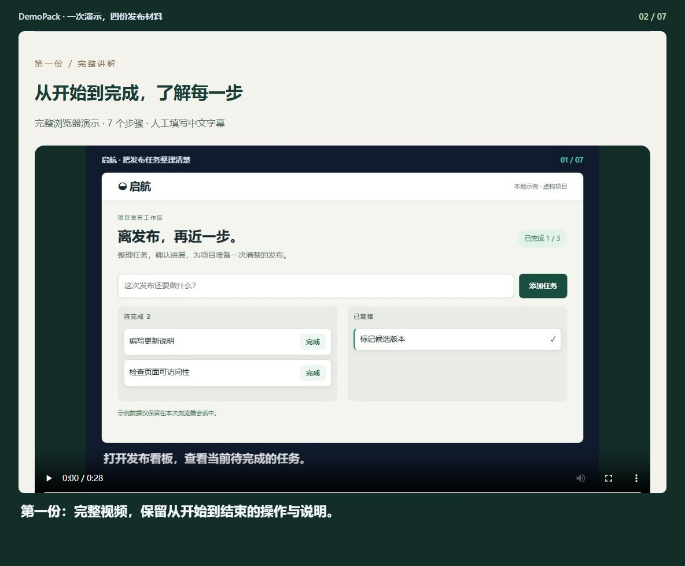
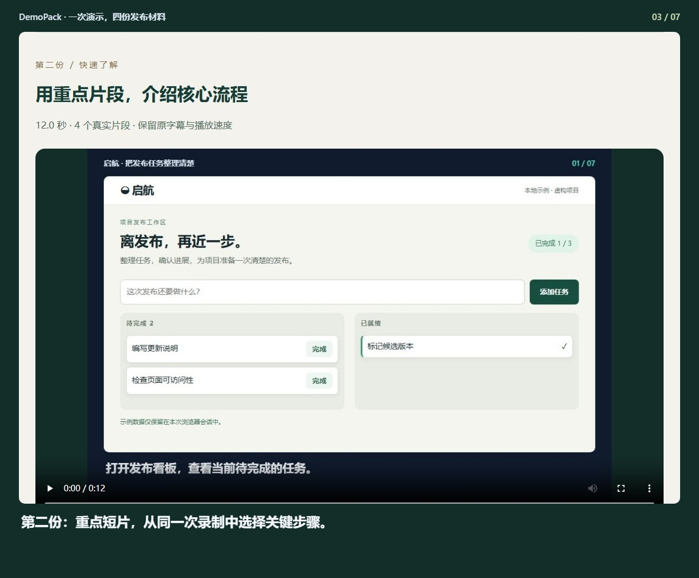
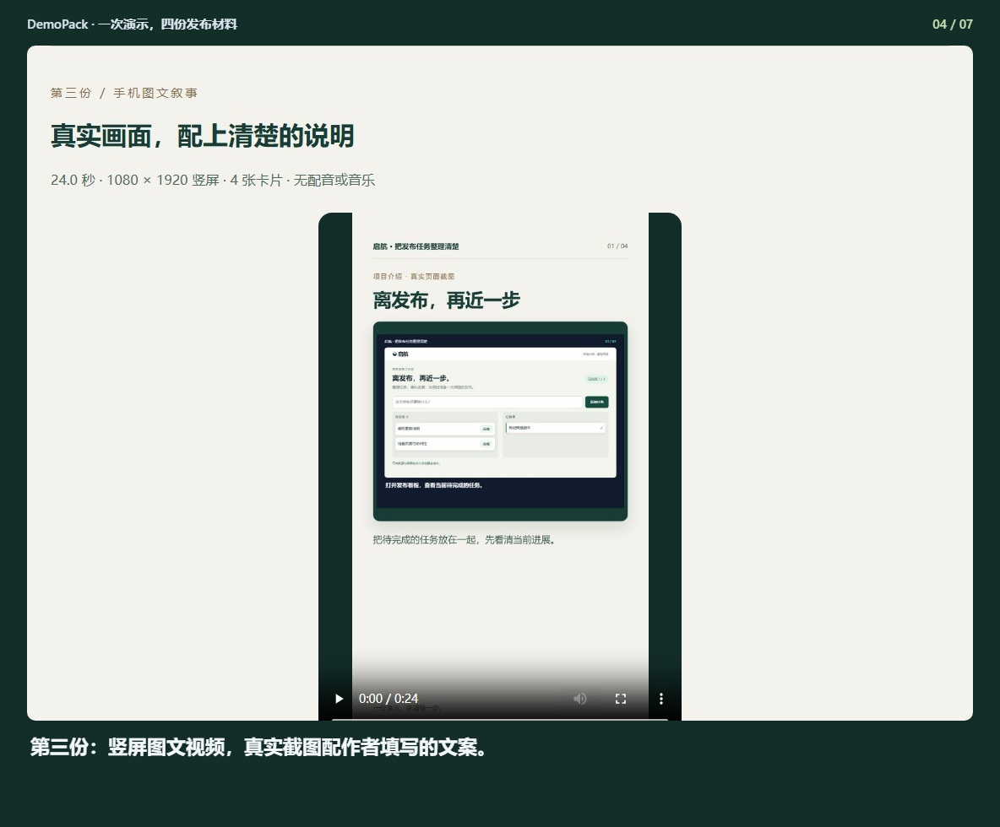
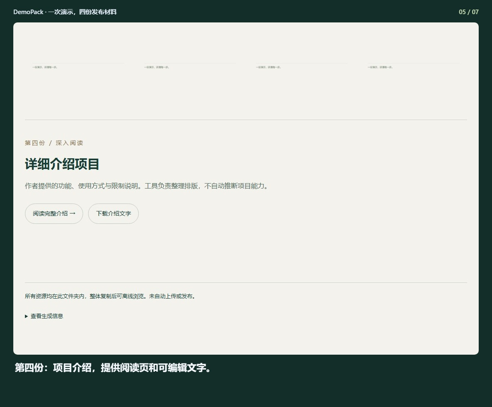
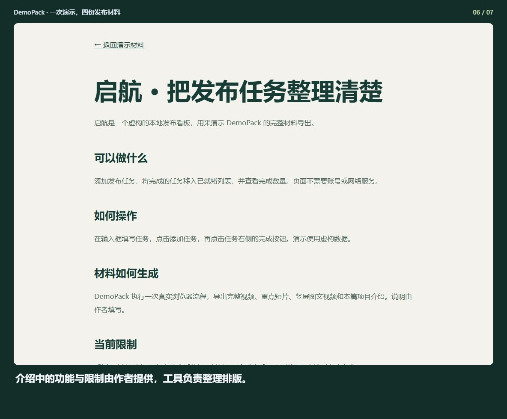
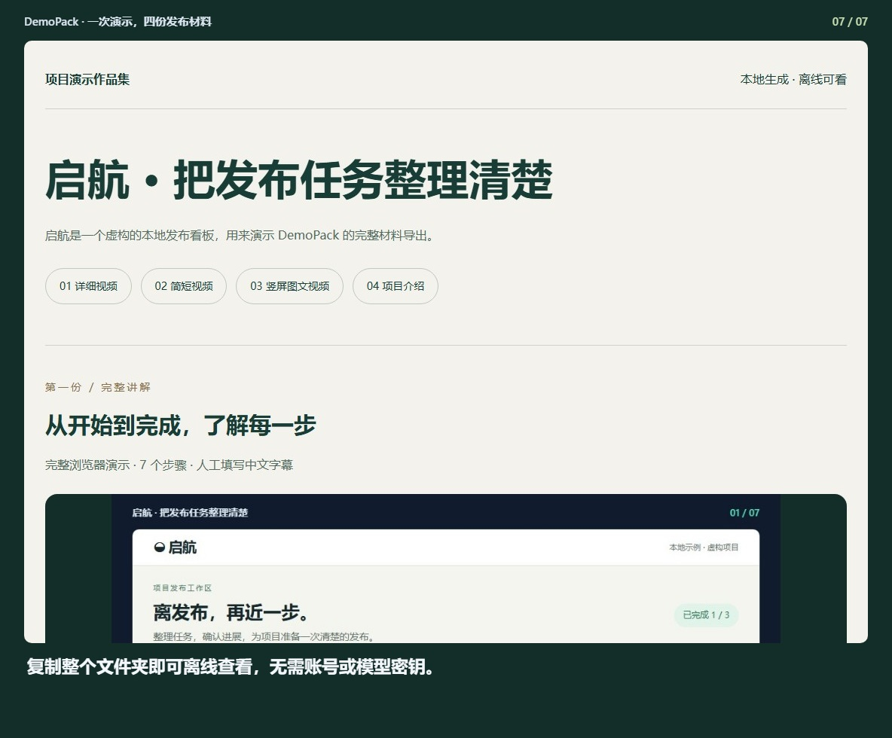

## DemoPack · 一次演示，四份发布材料

[观看完整视频](demo.mp4) · [离线预览](index.html)

### 1. 这是真实生成的材料包，四个入口对应四种使用方式。

### 2. 第一份：完整视频，保留从开始到结束的操作与说明。

### 3. 第二份：重点短片，从同一次录制中选择关键步骤。

### 4. 第三份：竖屏图文视频，真实截图配作者填写的文案。

### 5. 第四份：项目介绍，提供阅读页和可编辑文字。

### 6. 介绍中的功能与限制由作者提供，工具负责整理排版。

### 7. 复制整个文件夹即可离线查看，无需账号或模型密钥。

生成记录 `2026-09-16T02-31-34-103Z-6c899319`. 请整体复制此文件夹，以保留相对图片链接。
