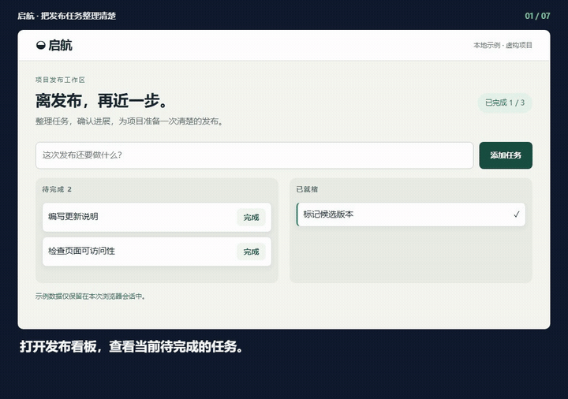
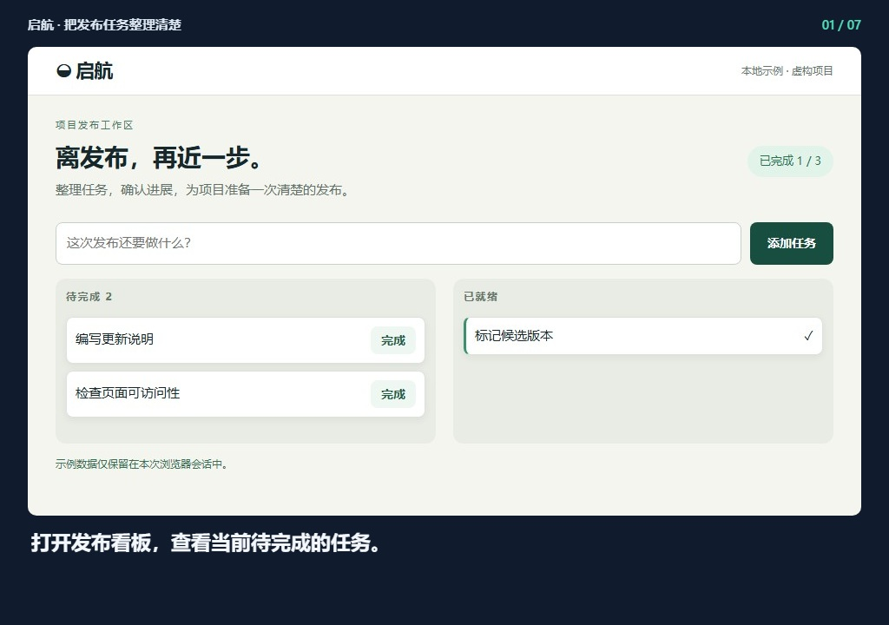
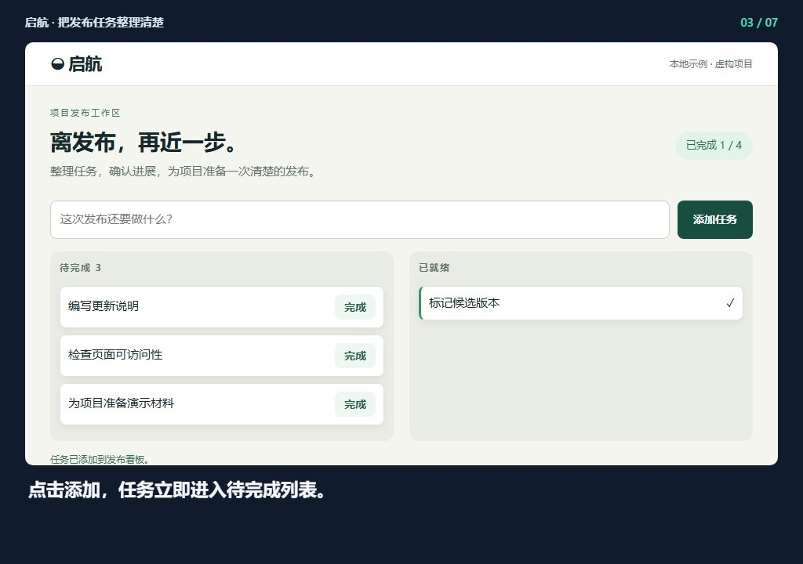
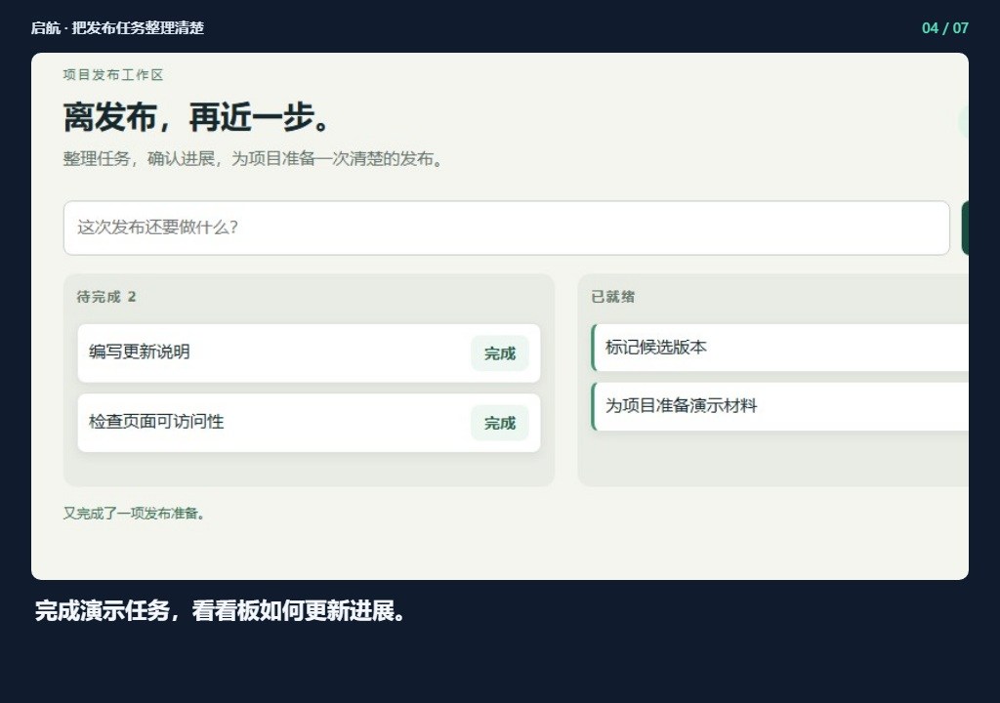
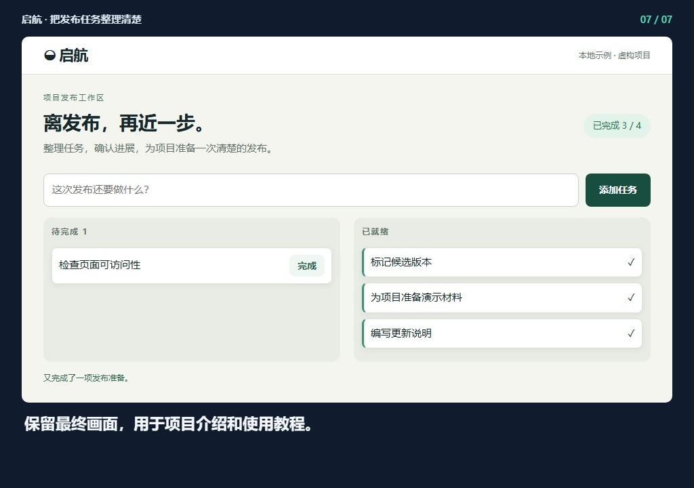

## 启航 · 把发布任务整理清楚

[观看完整视频](demo.mp4) · [离线预览](index.html)

### 1. 打开发布看板，查看当前待完成的任务。

### 2. 填写一条新任务：为项目准备演示材料。

### 3. 点击添加，任务立即进入待完成列表。

### 4. 完成演示任务，看看板如何更新进展。

### 5. 继续完成更新说明，整理本次发布的成果。

### 6. 确认已完成三项任务，数字与实际状态一致。

### 7. 保留最终画面，用于项目介绍和使用教程。

生成记录 `2026-09-16T02-27-03-535Z-7c939f0e`. 请整体复制此文件夹，以保留相对图片链接。
