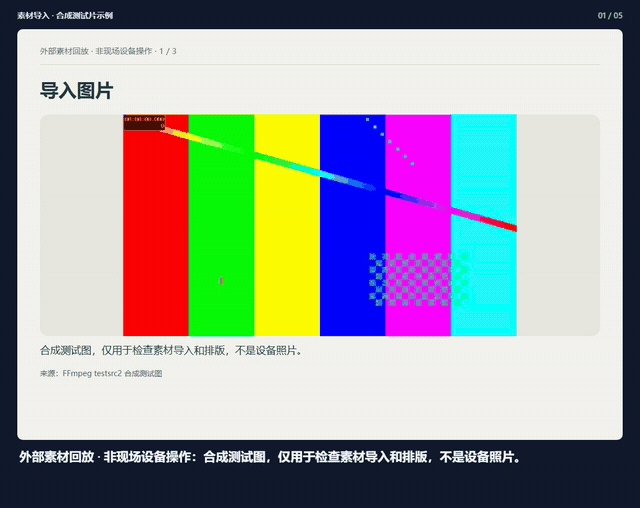
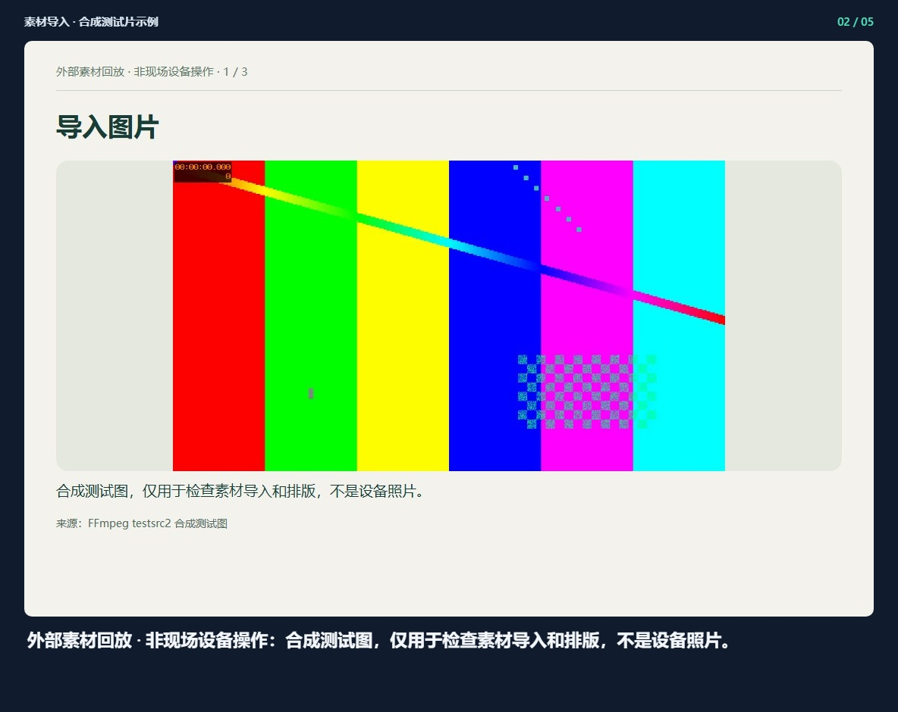
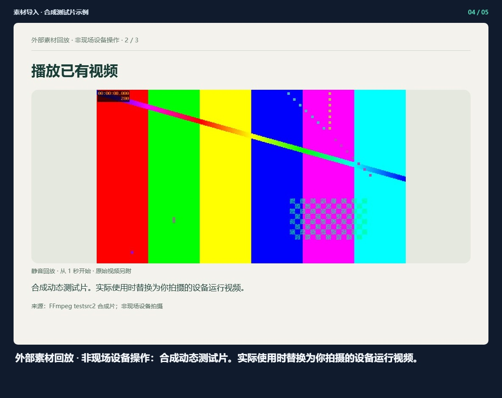
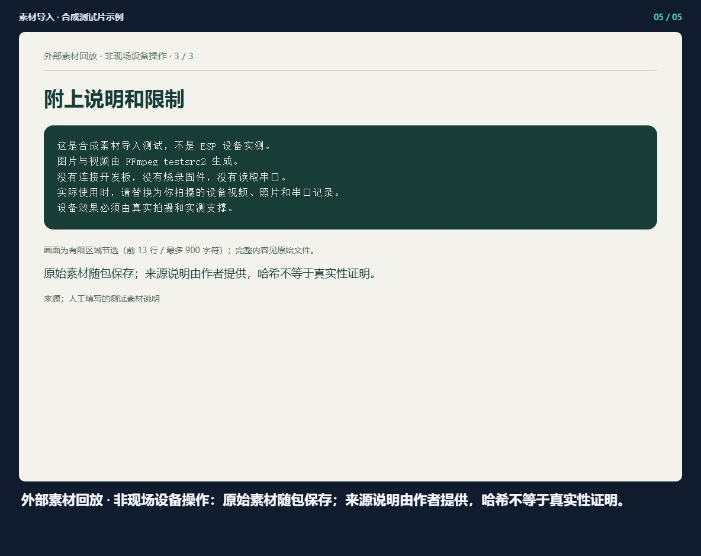

## 素材导入 · 合成测试片示例

[观看完整视频](demo.mp4) · [离线预览](index.html)

### 1. 外部素材回放 · 非现场设备操作：合成测试图，仅用于检查素材导入和排版，不是设备照片。

### 2. 外部素材回放 · 非现场设备操作：合成测试图，仅用于检查素材导入和排版，不是设备照片。

### 3. 外部素材回放 · 非现场设备操作：合成动态测试片。实际使用时替换为你拍摄的设备运行视频。

### 4. 外部素材回放 · 非现场设备操作：合成动态测试片。实际使用时替换为你拍摄的设备运行视频。

### 5. 外部素材回放 · 非现场设备操作：原始素材随包保存；来源说明由作者提供，哈希不等于真实性证明。

生成记录 `2026-09-16T04-01-02-057Z-e63149a6`. 请整体复制此文件夹，以保留相对图片链接。

外部素材的浏览器回放，不是现场设备操作。[来源与原始文件](source.html)
