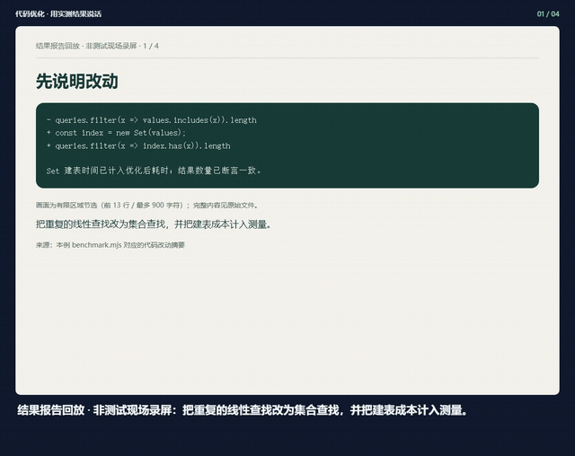
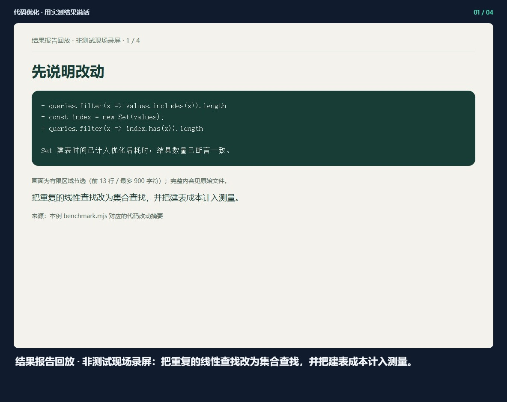
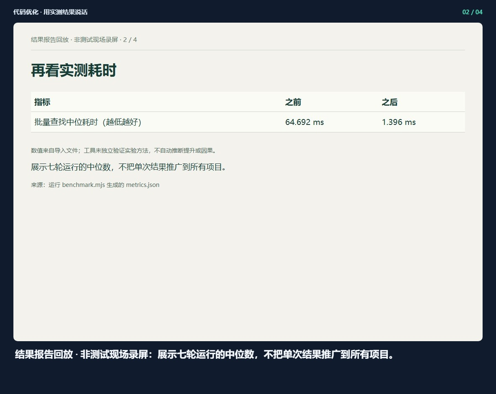
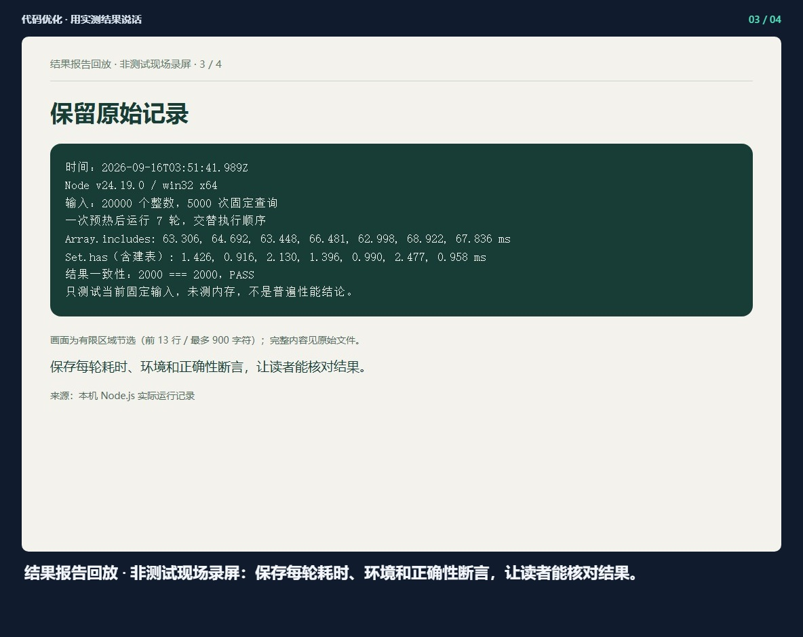
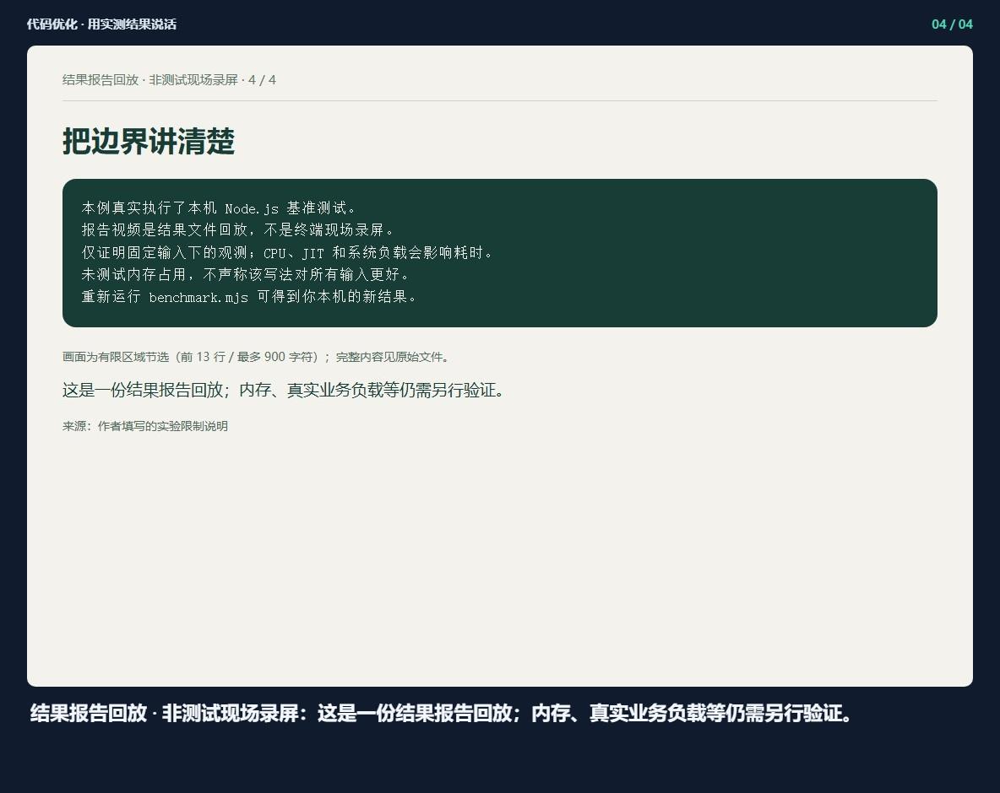

## 代码优化 · 用实测结果说话

[观看完整视频](demo.mp4) · [离线预览](index.html)

### 1. 结果报告回放 · 非测试现场录屏：把重复的线性查找改为集合查找，并把建表成本计入测量。

### 2. 结果报告回放 · 非测试现场录屏：展示七轮运行的中位数，不把单次结果推广到所有项目。

### 3. 结果报告回放 · 非测试现场录屏：保存每轮耗时、环境和正确性断言，让读者能核对结果。

### 4. 结果报告回放 · 非测试现场录屏：这是一份结果报告回放；内存、真实业务负载等仍需另行验证。

生成记录 `2026-09-16T04-00-22-154Z-48b59339`. 请整体复制此文件夹，以保留相对图片链接。

导入结果报告的浏览器回放，不是测试现场录屏。[来源与原始文件](source.html)
