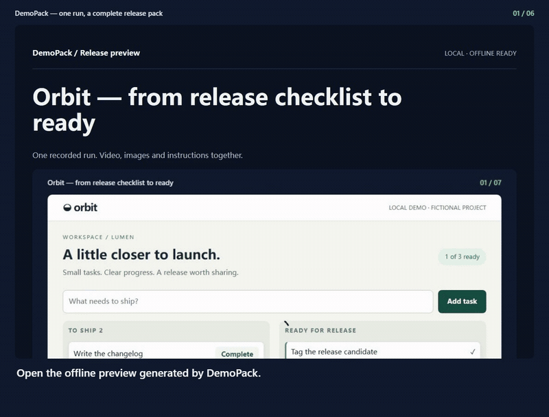
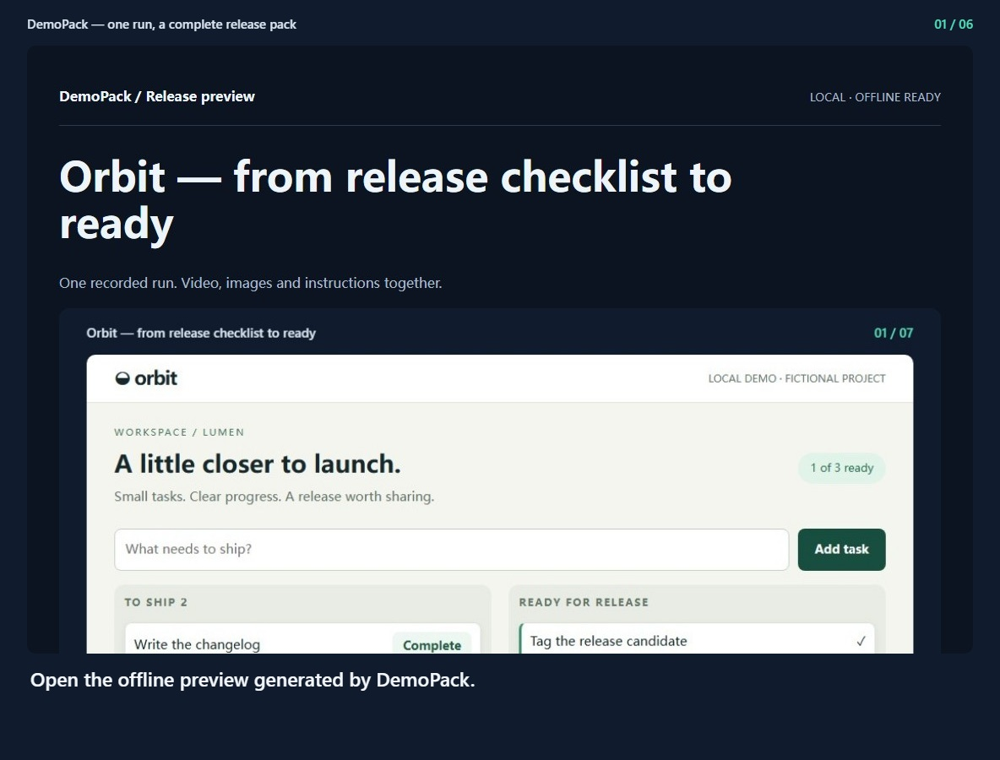
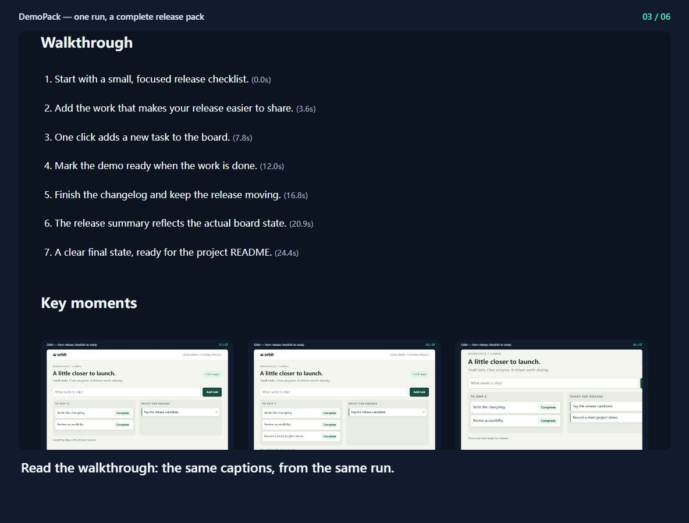
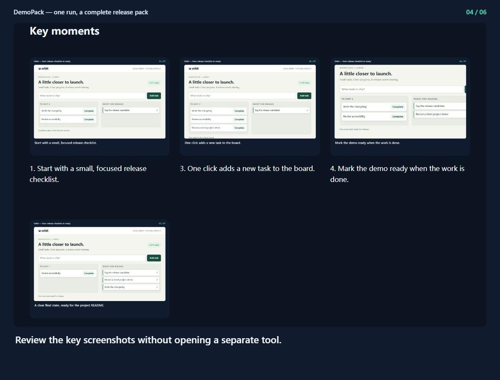
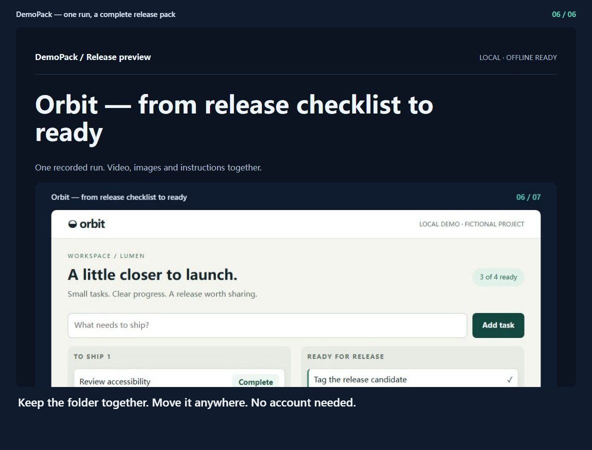

## DemoPack — one run, a complete release pack

[Watch the video](demo.mp4) · [Offline preview](index.html)

### 1. Open the offline preview generated by DemoPack.

### 2. Play the real browser recording inside the material pack.

### 3. Read the walkthrough: the same captions, from the same run.

### 4. Review the key screenshots without opening a separate tool.

### 5. Download relative-path Markdown for your project README.

### 6. Keep the folder together. Move it anywhere. No account needed.

Generated from run `2026-09-16T01-17-59-940Z-36439b17`. Copy this entire folder to preserve relative links.
