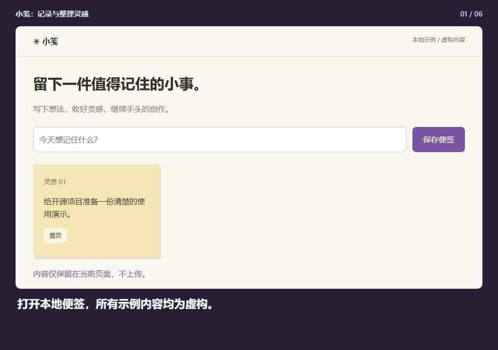

## 小笺：记录与整理灵感

[Watch the video](demo.mp4) · [Offline preview](index.html)

### 1. 打开本地便签，所有示例内容均为虚构。

### 2. 输入一条想法：为开源项目准备演示。

### 3. 保存后，新便签立即出现在列表中。

### 4. 把重要想法置顶，方便下次继续。

### 5. 确认操作结果，中文说明与实际页面同步。

### 6. 同一次运行，留下可放入教程的关键画面。

Generated from run `2026-09-16T01-17-35-384Z-6d35bee5`. Copy this entire folder to preserve relative links.
