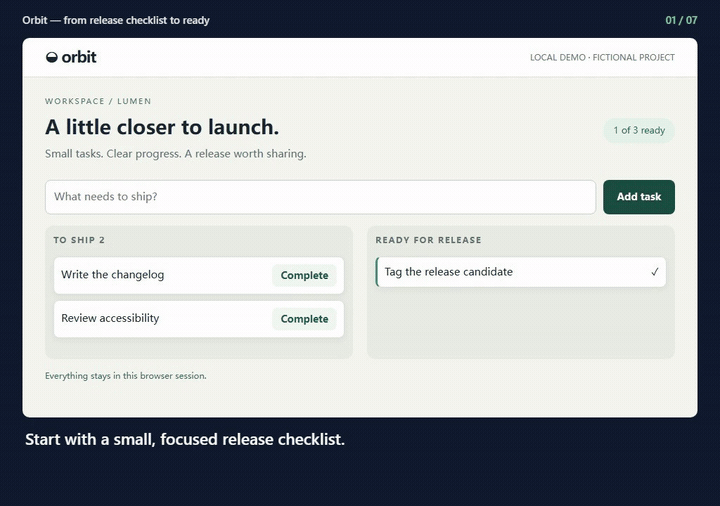
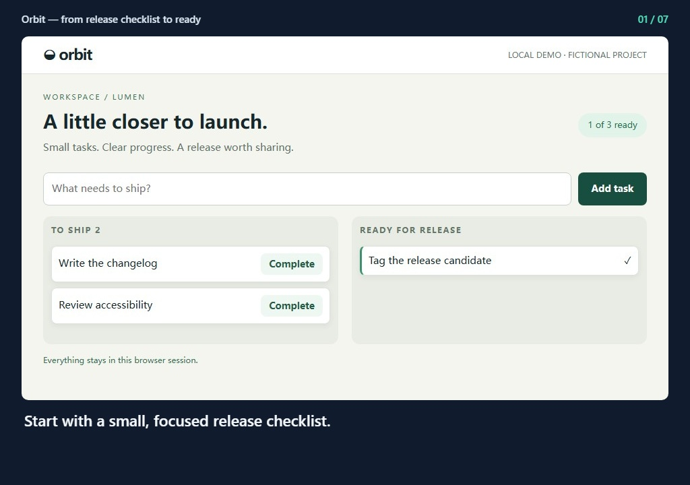
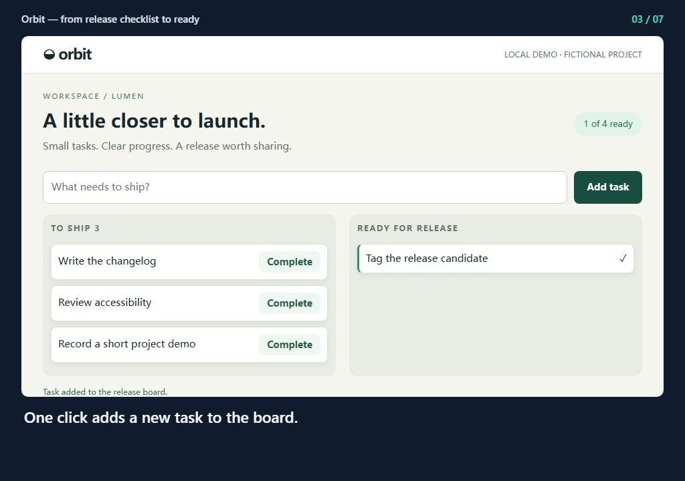
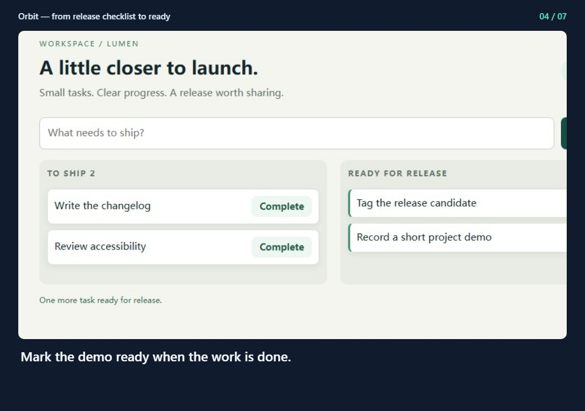
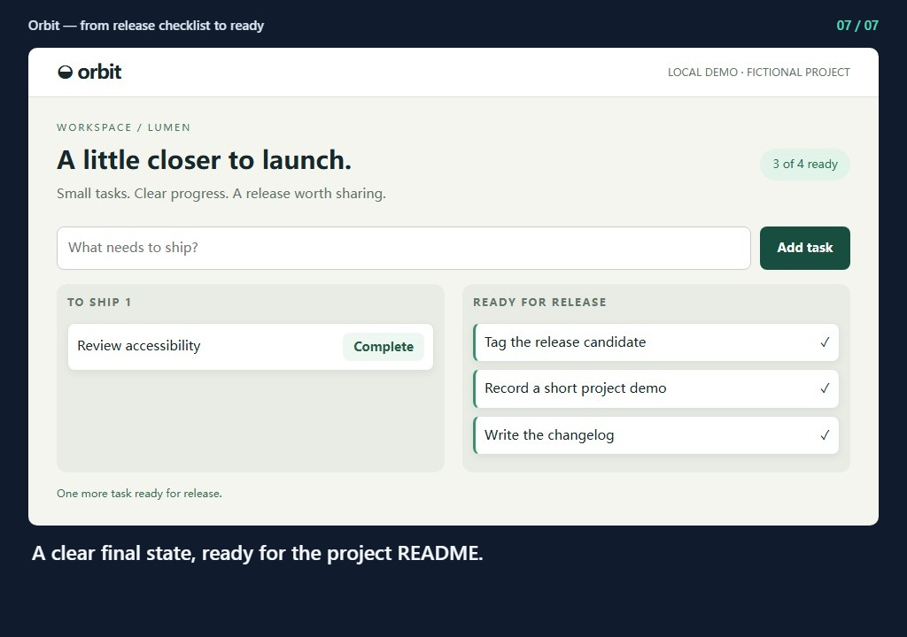

## Orbit — from release checklist to ready

[Watch the video](demo.mp4) · [Offline preview](index.html)

### 1. Start with a small, focused release checklist.

### 2. Add the work that makes your release easier to share.

### 3. One click adds a new task to the board.

### 4. Mark the demo ready when the work is done.

### 5. Finish the changelog and keep the release moving.

### 6. The release summary reflects the actual board state.

### 7. A clear final state, ready for the project README.

Generated from run `2026-09-16T01-16-36-480Z-55dee647`. Copy this entire folder to preserve relative links.
