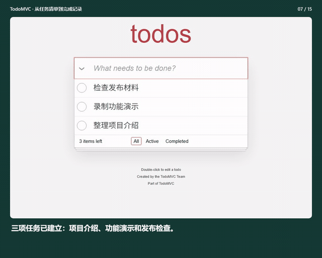
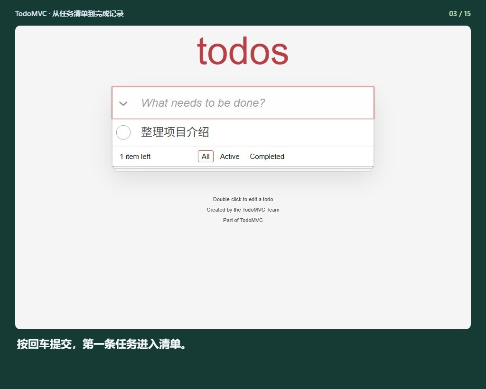
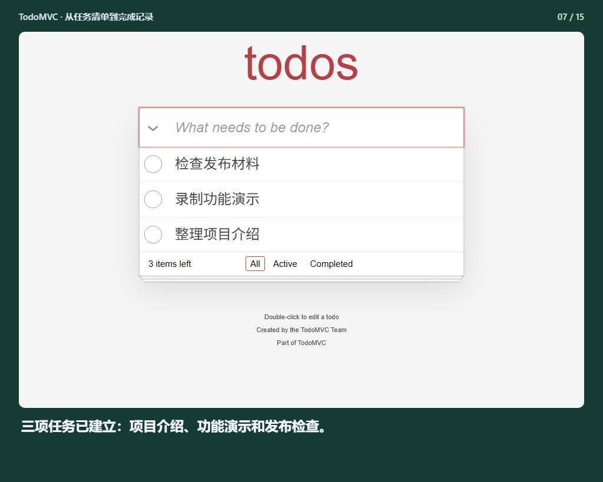
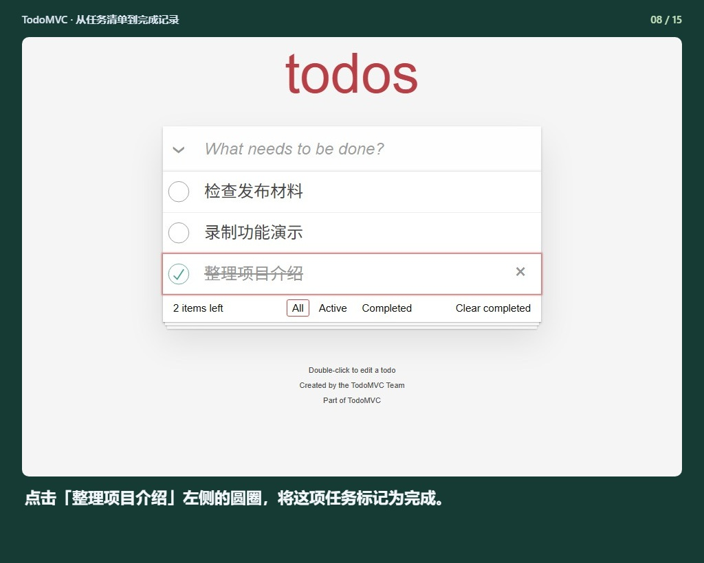
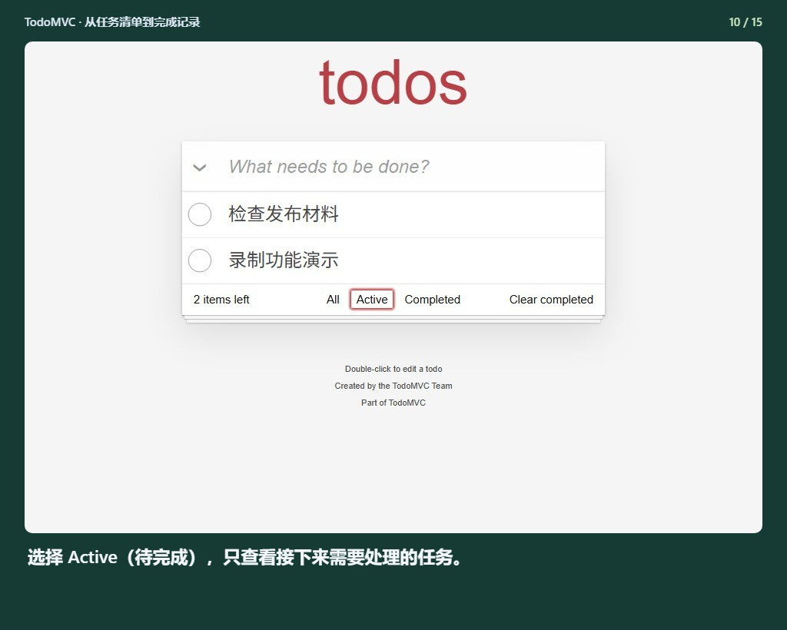
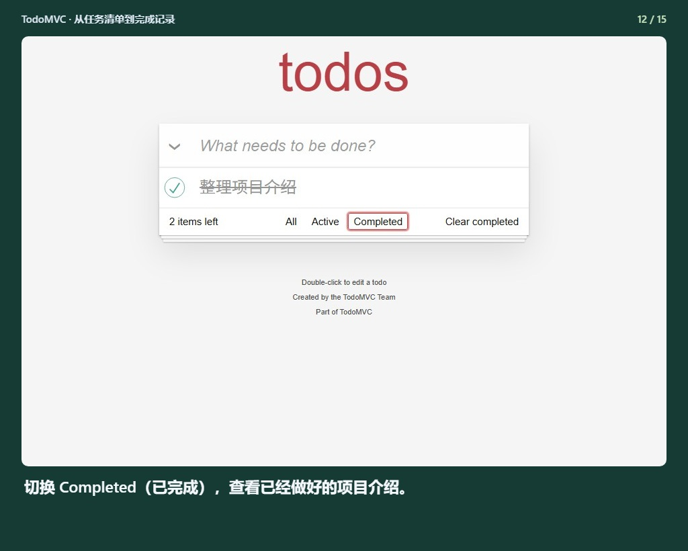
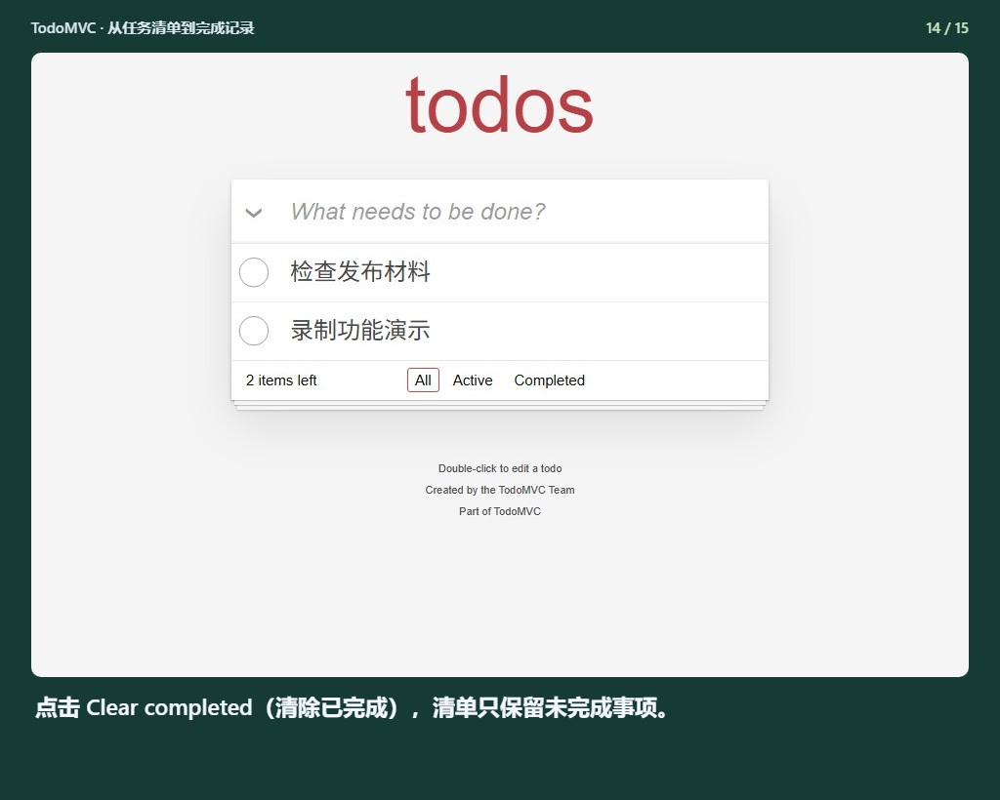
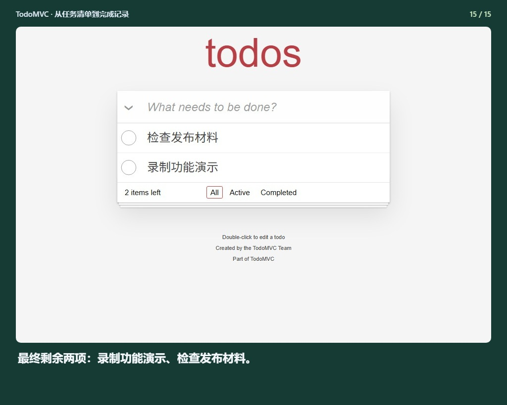

## TodoMVC · 从任务清单到完成记录

[观看完整视频](demo.mp4) · [离线预览](index.html)

### 1. TodoMVC：用一份简单的任务清单，体验完整的待办流程。

### 2. 第一步：在顶部输入框填写任务，所有内容均为虚构演示数据。

### 3. 按回车提交，第一条任务进入清单。

### 4. 继续添加第二条：录制功能演示。

### 5. 再次回车提交，待完成数量随之更新。

### 6. 再添加一项检查任务，把发布前的工作列清楚。

### 7. 三项任务已建立：项目介绍、功能演示和发布检查。

### 8. 点击「整理项目介绍」左侧的圆圈，将这项任务标记为完成。

### 9. 确认完成状态：文字出现删除线，剩余待办变为两项。

### 10. 选择 Active（待完成），只查看接下来需要处理的任务。

### 11. 待完成视图保留录制演示和检查材料，便于专注下一步。

### 12. 切换 Completed（已完成），查看已经做好的项目介绍。

### 13. 回到 All（全部），把已完成和待完成任务放在一起检查。

### 14. 点击 Clear completed（清除已完成），清单只保留未完成事项。

### 15. 最终剩余两项：录制功能演示、检查发布材料。

生成记录 `2026-09-16T03-10-29-347Z-e98214b4`. 请整体复制此文件夹，以保留相对图片链接。
